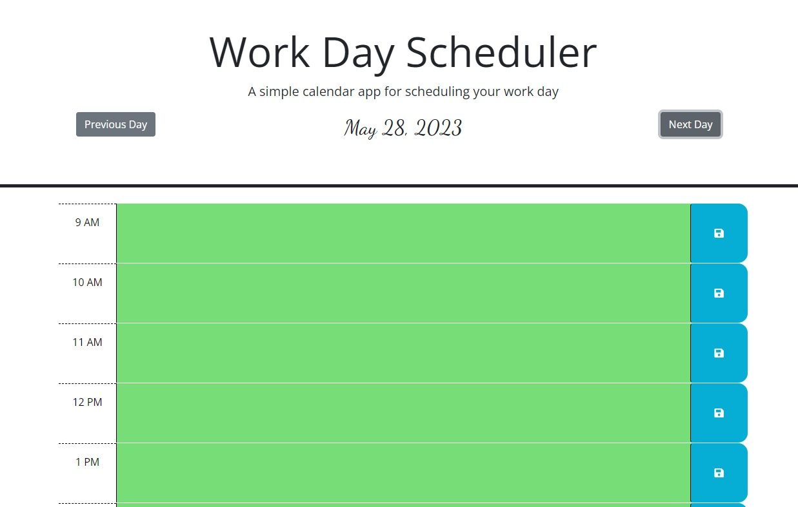

# WORKDAY SCHEDULER

## DESCRIPTION

This is an app to schedule workdays from 9am to 5pm. It saves each hour block locally.  The date is at the top of the page along with buttons to switch between days.

## USAGE

[Link to Planner Page](https://yajiit.github.io/Homework05--Workday-Planner/)
The date appears at the top of the scheduler. Type in the plans for an hour block then click on the corresponding blue button to save into local storage.  To switch dates click the "Previous Day" or "Next Day" button beside the current date.  The displayed date will change, along with the schedule for that day.  To return to the current date at any time, simply refresh the page.

## FEATURES

- Saves individual hour blocks across multiple dates
- Color coded hour blocks based on past, present, or future
- Ability to cycle through dates

## SCREENSHOT

## LICENSE

MIT License

Copyright (c) 2023 Yajiit

Permission is hereby granted, free of charge, to any person obtaining a copy
of this software and associated documentation files (the "Software"), to deal
in the Software without restriction, including without limitation the rights
to use, copy, modify, merge, publish, distribute, sublicense, and/or sell
copies of the Software, and to permit persons to whom the Software is
furnished to do so, subject to the following conditions:

The above copyright notice and this permission notice shall be included in all
copies or substantial portions of the Software.

THE SOFTWARE IS PROVIDED "AS IS", WITHOUT WARRANTY OF ANY KIND, EXPRESS OR
IMPLIED, INCLUDING BUT NOT LIMITED TO THE WARRANTIES OF MERCHANTABILITY,
FITNESS FOR A PARTICULAR PURPOSE AND NONINFRINGEMENT. IN NO EVENT SHALL THE
AUTHORS OR COPYRIGHT HOLDERS BE LIABLE FOR ANY CLAIM, DAMAGES OR OTHER
LIABILITY, WHETHER IN AN ACTION OF CONTRACT, TORT OR OTHERWISE, ARISING FROM,
OUT OF OR IN CONNECTION WITH THE SOFTWARE OR THE USE OR OTHER DEALINGS IN THE
SOFTWARE.